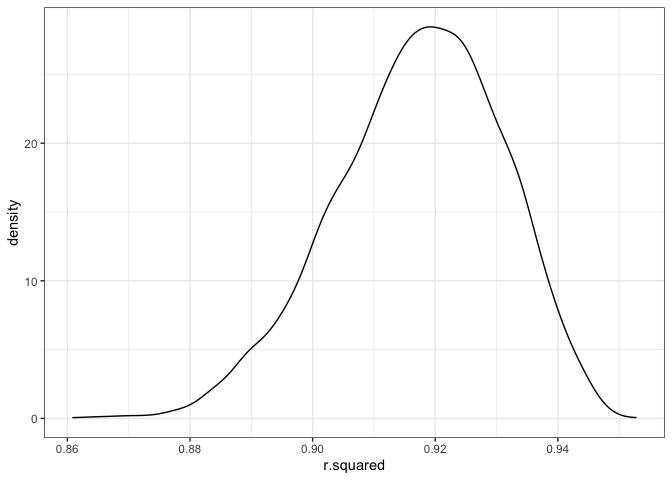
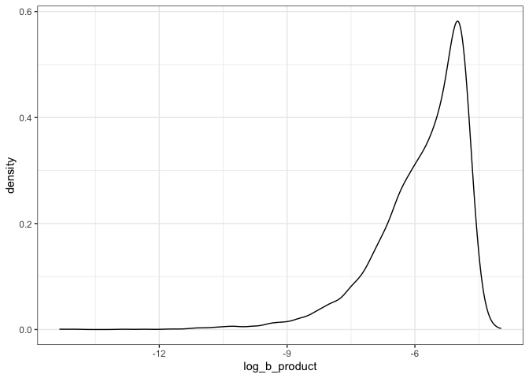

p8105_hw6_nkr2121
================
Nihaal Rahman

Loading the required packages

``` r
library(tidyverse)
```

# Question 2

Reading in the data

``` r
weather_df = 
  rnoaa::meteo_pull_monitors(
    c("USW00094728"),
    var = c("PRCP", "TMIN", "TMAX"), 
    date_min = "2022-01-01",
    date_max = "2022-12-31") |>
  mutate(
    name = recode(id, USW00094728 = "CentralPark_NY"),
    tmin = tmin / 10,
    tmax = tmax / 10) |>
  select(name, id, everything())
```

Bootstrap sample

``` r
set.seed(100)

sample = function(df) {
  sample_frac(df, replace = TRUE)
}

boot_sample = tibble(num = 1:5000) |> 
  mutate(
    sample = map(num, \(i) sample(weather_df))
  )

results =   
  boot_sample |> 
  mutate(
    models = map(sample, \(df) lm(tmax ~ tmin + prcp, data = df)),
    lm = map(models, broom::tidy),
    glance = map(models, broom::glance)) |> 
  unnest(lm, glance) |> 
  select(num, term, estimate, r.squared) |> 
  pivot_wider(names_from = term, values_from = estimate) |> 
  mutate(log_b_product = log(tmin * abs(prcp)))
```

Plotting

``` r
results |> 
  ggplot(aes(x = r.squared)) + 
  geom_density() +
  theme_bw()
```

<!-- -->

``` r
results |> 
  ggplot(aes(x = log_b_product)) + 
  geom_density() +
  theme_bw()
```

<!-- -->

The distribution of r-squared values seems to be slightly left skewed
with a peak around 0.91. The distribution of log_b_product is very left
skewed, with steep peak around -5 (also, for reference, I used the
absolute value of prcp when calculating the log product due to missing
values otherwise).

95% Confidence Intervals

``` r
ci_rsquared = results |> 
  pull(r.squared) |> 
  quantile(c(0.025, 0.975), na.rm = TRUE)
ci_rsquared
```

    ##      2.5%     97.5% 
    ## 0.8885805 0.9405510

``` r
ci_log_b_product = results |> 
  pull(log_b_product) |> 
  quantile(c(0.025, 0.975), na.rm = TRUE)
ci_log_b_product
```

    ##      2.5%     97.5% 
    ## -8.586390 -4.618344

# Question 3

Reading in the data

``` r
birthweight <- read_csv("birthweight.csv")
```
